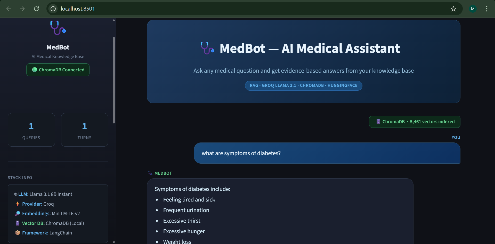

# 🩺 MedBot - Medical RAG Chatbot

Chat with your own medical PDFs. Ask questions, get answers with exact source references, no hallucinations, no internet needed.

---

## Stack

LLM: Llama 3.1 8B via Groq 
Embeddings: MiniLM-L6-v2 (HuggingFace) 
Vector DB: ChromaDB (local) 
Framework: LangChain + Streamlit 

---

## Quick Start

```bash
# 1. Install
pip install -r requirements.txt

# 2. Add API key to .env
GROQ_API_KEY=your_key_here

# 3. Drop PDFs into data/ then build the index
python create_memory_for_llm.py

# 4. Run
streamlit run app.py
```

---

## How it works

PDFs → chunked → embedded → stored in ChromaDB.
At query time: question → similarity search → top 3 chunks → Groq LLM → answer + source page.

---

## Files

```
├── create_memory_for_llm.py    # Ingest PDFs → build ChromaDB index
├── connect_memory_with_llm.py  # CLI version for testing
├── app.py                      # Streamlit chat UI
├── data/                       # Your PDFs go here
└── vectorstore/db_chroma/      # Auto-created index
```

---

## 🖥️ UI Preview



> Answers are limited to what's in your documents. If it's not there, the bot says so.
